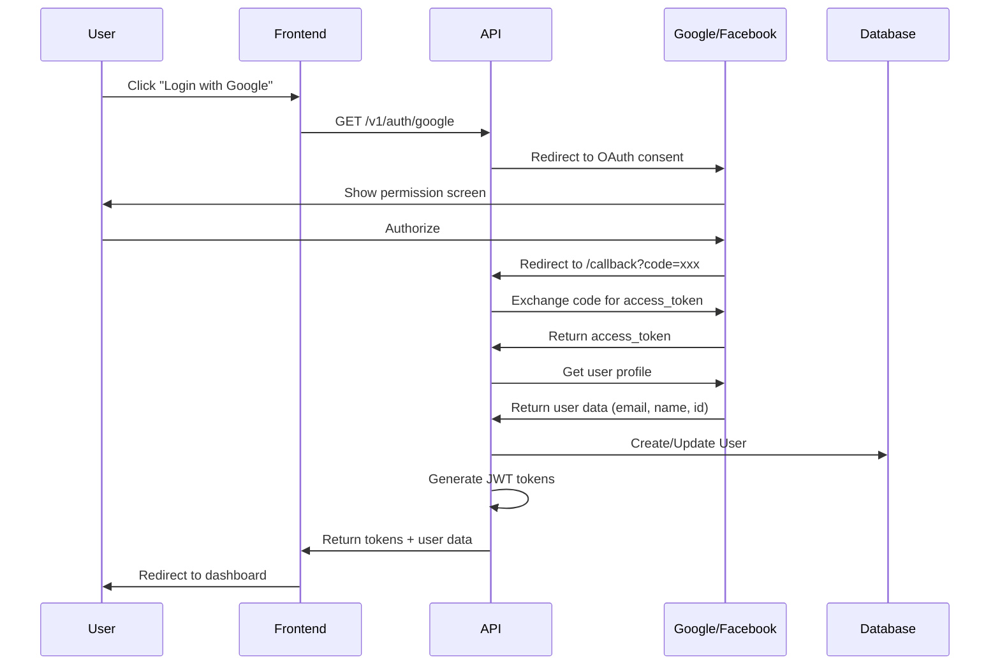

# OAuth2 Authentication Setup (Google & Facebook)

## 🔐 Overview

API mendukung 3 metode autentikasi:
1. **Email/Password** - Traditional authentication
2. **Google OAuth2** - Social login dengan Google
3. **Facebook OAuth2** - Social login dengan Facebook

Semua metode menghasilkan JWT token yang sama untuk akses API.

---

## 🌐 OAuth2 Flow

### User Perspective
```
1. User clicks "Login with Google" button
   ↓
2. Frontend redirects to: GET /v1/auth/google
   ↓
3. API redirects to Google consent screen
   ↓
4. User authorizes the app
   ↓
5. Google redirects to: GET /v1/auth/google/callback?code=xxx
   ↓
6. API exchanges code for user info
   ↓
7. API creates/updates User record
   ↓
8. API returns JWT tokens
   ↓
9. Frontend stores tokens and redirects to dashboard
```

### Technical Flow


---

## 🔧 Setup Instructions

### 1. Google OAuth2 Setup

#### A. Create Google Cloud Project
1. Go to [Google Cloud Console](https://console.cloud.google.com/)
2. Create new project: "Keramik Store"
3. Enable **Google+ API** / **Google Identity**

#### B. Create OAuth2 Credentials
1. Go to **APIs & Services** → **Credentials**
2. Click **Create Credentials** → **OAuth 2.0 Client ID**
3. Application type: **Web application**
4. Name: "Keramik Store Web"
5. **Authorized JavaScript origins:**
   ```
   http://localhost:3000
   https://api.keramik-store.com
   ```
6. **Authorized redirect URIs:**
   ```
   http://localhost:3000/api/v1/auth/google/callback
   https://api.keramik-store.com/api/v1/auth/google/callback
   ```
7. Click **Create**
8. Copy **Client ID** and **Client Secret**

#### C. Configure OAuth Consent Screen
1. Go to **OAuth consent screen**
2. User type: **External** (for public) or **Internal** (for organization only)
3. Fill required fields:
   - App name: "Keramik Store"
   - User support email: your@email.com
   - Developer contact: your@email.com
4. Scopes: Add **email**, **profile**, **openid**
5. Save and continue

---

### 2. Facebook OAuth2 Setup

#### A. Create Facebook App
1. Go to [Facebook Developers](https://developers.facebook.com/)
2. Click **My Apps** → **Create App**
3. Use case: **Authenticate and request data from users**
4. App name: "Keramik Store"
5. Contact email: your@email.com

#### B. Configure Facebook Login
1. In app dashboard, click **Add Product**
2. Find **Facebook Login** → **Set Up**
3. Platform: **Web**
4. Site URL: `http://localhost:3000` (development)
5. Go to **Facebook Login** → **Settings**
6. **Valid OAuth Redirect URIs:**
   ```
   http://localhost:3000/api/v1/auth/facebook/callback
   https://api.keramik-store.com/api/v1/auth/facebook/callback
   ```
7. Save changes

#### C. Get App Credentials
1. Go to **Settings** → **Basic**
2. Copy **App ID** (Client ID)
3. Show and copy **App Secret** (Client Secret)

---

### 3. Environment Variables

Add to `.env`:

```bash
# Google OAuth2
GOOGLE_CLIENT_ID=your-google-client-id.apps.googleusercontent.com
GOOGLE_CLIENT_SECRET=your-google-client-secret
GOOGLE_CALLBACK_URL=http://localhost:3000/api/v1/auth/google/callback

# Facebook OAuth2
FACEBOOK_APP_ID=your-facebook-app-id
FACEBOOK_APP_SECRET=your-facebook-app-secret
FACEBOOK_CALLBACK_URL=http://localhost:3000/api/v1/auth/facebook/callback

# Frontend URL (for redirect after OAuth)
FRONTEND_URL=http://localhost:3001
```

**Production:**
```bash
GOOGLE_CALLBACK_URL=https://api.keramik-store.com/api/v1/auth/google/callback
FACEBOOK_CALLBACK_URL=https://api.keramik-store.com/api/v1/auth/facebook/callback
FRONTEND_URL=https://keramik-store.com
```

---

## 💻 Implementation

### NestJS Passport Strategy

Install dependencies:
```bash
npm install @nestjs/passport passport passport-google-oauth20 passport-facebook
npm install -D @types/passport-google-oauth20 @types/passport-facebook
```

### Google Strategy (`src/auth/strategies/google.strategy.ts`)
```typescript
import { Injectable } from '@nestjs/common';
import { PassportStrategy } from '@nestjs/passport';
import { Strategy, VerifyCallback } from 'passport-google-oauth20';
import { ConfigService } from '@nestjs/config';

@Injectable()
export class GoogleStrategy extends PassportStrategy(Strategy, 'google') {
  constructor(private configService: ConfigService) {
    super({
      clientID: configService.get('GOOGLE_CLIENT_ID'),
      clientSecret: configService.get('GOOGLE_CLIENT_SECRET'),
      callbackURL: configService.get('GOOGLE_CALLBACK_URL'),
      scope: ['email', 'profile'],
    });
  }

  async validate(
    accessToken: string,
    refreshToken: string,
    profile: any,
    done: VerifyCallback,
  ): Promise<any> {
    const { name, emails, photos, id } = profile;
    const user = {
      email: emails[0].value,
      name: `${name.givenName} ${name.familyName}`,
      provider: 'google',
      providerId: id,
      picture: photos[0]?.value,
    };
    done(null, user);
  }
}
```

### Facebook Strategy (`src/auth/strategies/facebook.strategy.ts`)
```typescript
import { Injectable } from '@nestjs/common';
import { PassportStrategy } from '@nestjs/passport';
import { Strategy, Profile } from 'passport-facebook';
import { ConfigService } from '@nestjs/config';

@Injectable()
export class FacebookStrategy extends PassportStrategy(Strategy, 'facebook') {
  constructor(private configService: ConfigService) {
    super({
      clientID: configService.get('FACEBOOK_APP_ID'),
      clientSecret: configService.get('FACEBOOK_APP_SECRET'),
      callbackURL: configService.get('FACEBOOK_CALLBACK_URL'),
      scope: ['email', 'public_profile'],
      profileFields: ['id', 'emails', 'name', 'picture.type(large)'],
    });
  }

  async validate(
    accessToken: string,
    refreshToken: string,
    profile: Profile,
    done: (err: any, user: any, info?: any) => void,
  ): Promise<any> {
    const { name, emails, photos, id } = profile;
    const user = {
      email: emails[0].value,
      name: `${name.givenName} ${name.familyName}`,
      provider: 'facebook',
      providerId: id,
      picture: photos[0]?.value,
    };
    done(null, user);
  }
}
```

### Auth Controller (`src/auth/auth.controller.ts`)
```typescript
import { Controller, Get, Req, Res, UseGuards } from '@nestjs/common';
import { AuthGuard } from '@nestjs/passport';
import { AuthService } from './auth.service';
import { Response } from 'express';
import { ConfigService } from '@nestjs/config';

@Controller('auth')
export class AuthController {
  constructor(
    private authService: AuthService,
    private configService: ConfigService,
  ) {}

  // Google OAuth2
  @Get('google')
  @UseGuards(AuthGuard('google'))
  async googleAuth() {
    // Redirects to Google
  }

  @Get('google/callback')
  @UseGuards(AuthGuard('google'))
  async googleAuthCallback(@Req() req, @Res() res: Response) {
    const { accessToken, refreshToken, user } = 
      await this.authService.handleOAuthLogin(req.user);

    // Redirect to frontend with tokens
    const frontendUrl = this.configService.get('FRONTEND_URL');
    return res.redirect(
      `${frontendUrl}/auth/callback?accessToken=${accessToken}&refreshToken=${refreshToken}`
    );
  }

  // Facebook OAuth2
  @Get('facebook')
  @UseGuards(AuthGuard('facebook'))
  async facebookAuth() {
    // Redirects to Facebook
  }

  @Get('facebook/callback')
  @UseGuards(AuthGuard('facebook'))
  async facebookAuthCallback(@Req() req, @Res() res: Response) {
    const { accessToken, refreshToken, user } = 
      await this.authService.handleOAuthLogin(req.user);

    const frontendUrl = this.configService.get('FRONTEND_URL');
    return res.redirect(
      `${frontendUrl}/auth/callback?accessToken=${accessToken}&refreshToken=${refreshToken}`
    );
  }
}
```

### Auth Service (`src/auth/auth.service.ts`)
```typescript
import { Injectable } from '@nestjs/common';
import { JwtService } from '@nestjs/jwt';
import { PrismaService } from '../prisma/prisma.service';

@Injectable()
export class AuthService {
  constructor(
    private prisma: PrismaService,
    private jwtService: JwtService,
  ) {}

  async handleOAuthLogin(profile: {
    email: string;
    name: string;
    provider: string;
    providerId: string;
    picture?: string;
  }) {
    // Find or create user
    let user = await this.prisma.user.findUnique({
      where: {
        email: profile.email,
      },
    });

    if (!user) {
      // Create new user
      user = await this.prisma.user.create({
        data: {
          email: profile.email,
          name: profile.name,
          provider: profile.provider,
          providerId: profile.providerId,
          role: 'CUSTOMER',
          // No password for OAuth users
        },
      });
    } else if (!user.providerId) {
      // Update existing email/password user to link OAuth
      user = await this.prisma.user.update({
        where: { id: user.id },
        data: {
          provider: profile.provider,
          providerId: profile.providerId,
        },
      });
    }

    // Generate JWT tokens
    const payload = { sub: user.id, email: user.email, role: user.role };
    const accessToken = this.jwtService.sign(payload);
    const refreshToken = this.jwtService.sign(payload, { expiresIn: '7d' });

    return {
      accessToken,
      refreshToken,
      user: {
        id: user.id,
        email: user.email,
        name: user.name,
        role: user.role,
        provider: user.provider,
      },
    };
  }
}
```

---

## 🖥️ Frontend Integration

### React Example

```typescript
// Login Button Component
export function SocialLoginButtons() {
  const handleGoogleLogin = () => {
    // Redirect to backend OAuth endpoint
    window.location.href = 'http://localhost:3000/api/v1/auth/google';
  };

  const handleFacebookLogin = () => {
    window.location.href = 'http://localhost:3000/api/v1/auth/facebook';
  };

  return (
    <div className="social-login">
      <button onClick={handleGoogleLogin}>
        <GoogleIcon /> Login with Google
      </button>
      <button onClick={handleFacebookLogin}>
        <FacebookIcon /> Login with Facebook
      </button>
    </div>
  );
}

// Callback Handler Page (/auth/callback)
export function AuthCallbackPage() {
  useEffect(() => {
    const params = new URLSearchParams(window.location.search);
    const accessToken = params.get('accessToken');
    const refreshToken = params.get('refreshToken');

    if (accessToken && refreshToken) {
      // Store tokens
      localStorage.setItem('accessToken', accessToken);
      localStorage.setItem('refreshToken', refreshToken);

      // Redirect to dashboard
      window.location.href = '/dashboard';
    } else {
      // Handle error
      window.location.href = '/login?error=oauth_failed';
    }
  }, []);

  return <div>Authenticating...</div>;
}
```

---

## 🔒 Security Considerations

### 1. State Parameter (CSRF Protection)
```typescript
// Generate random state
const state = crypto.randomBytes(16).toString('hex');
// Store in session/cookie
req.session.oauthState = state;
// Pass to OAuth provider
// Verify on callback
```

### 2. Token Security
```typescript
// Use httpOnly cookies for tokens (recommended)
res.cookie('accessToken', token, {
  httpOnly: true,
  secure: process.env.NODE_ENV === 'production',
  sameSite: 'strict',
  maxAge: 15 * 60 * 1000, // 15 minutes
});
```

### 3. Email Verification
```typescript
// OAuth emails are pre-verified by providers
// No need for email verification flow
// But can add optional verification for linked accounts
```

---

## 🧪 Testing

### Manual Testing

1. **Google Login:**
   ```bash
   # Open in browser
   http://localhost:3000/api/v1/auth/google
   
   # Should redirect to Google login
   # After auth, should redirect to frontend with tokens
   ```

2. **Facebook Login:**
   ```bash
   # Open in browser
   http://localhost:3000/api/v1/auth/facebook
   
   # Should redirect to Facebook login
   # After auth, should redirect to frontend with tokens
   ```

3. **Check User in Database:**
   ```sql
   SELECT * FROM "User" WHERE provider = 'google';
   SELECT * FROM "User" WHERE provider = 'facebook';
   ```

### API Testing (After OAuth Login)
```bash
# Use the access token from OAuth callback
curl -H "Authorization: Bearer {accessToken}" \
  http://localhost:3000/api/v1/users/me

# Response should show OAuth user
{
  "id": "uuid",
  "email": "user@gmail.com",
  "name": "John Doe",
  "provider": "google",
  "providerId": "1234567890",
  "role": "CUSTOMER"
}
```

---

## 🐛 Troubleshooting

### Error: "redirect_uri_mismatch"
**Cause:** Callback URL tidak match dengan yang didaftarkan
**Fix:** 
- Check spelling di Google/Facebook console
- Pastikan include `/api/v1/auth/google/callback`
- Check protocol (http vs https)

### Error: "invalid_client"
**Cause:** Client ID atau Secret salah
**Fix:**
- Verify credentials di `.env`
- Re-copy dari console provider
- Check for trailing spaces

### User tidak ter-create di database
**Cause:** Email already exists dengan provider berbeda
**Fix:**
- Implement account linking
- Atau return error "Email already registered with email/password"

### Redirect loop
**Cause:** Frontend callback handler tidak store tokens
**Fix:**
- Debug callback page
- Check localStorage/cookies
- Check token expiry

---

## 📚 Additional Resources

- [Google OAuth2 Docs](https://developers.google.com/identity/protocols/oauth2)
- [Facebook Login Docs](https://developers.facebook.com/docs/facebook-login)
- [Passport.js Strategies](http://www.passportjs.org/packages/)
- [NestJS Passport Integration](https://docs.nestjs.com/security/authentication)

---

## ✅ Checklist

- [ ] Google Cloud project created
- [ ] Google OAuth credentials obtained
- [ ] Facebook app created
- [ ] Facebook OAuth credentials obtained
- [ ] Environment variables configured
- [ ] Strategies implemented in NestJS
- [ ] Controller endpoints added
- [ ] Frontend redirect handlers added
- [ ] Tested Google login flow
- [ ] Tested Facebook login flow
- [ ] Verified user creation in database
- [ ] Production URLs configured (when deploying)

Semoga membantu! 🚀
